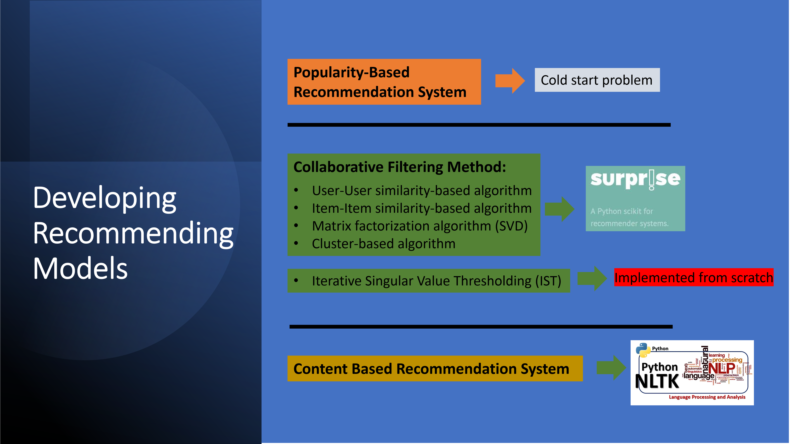
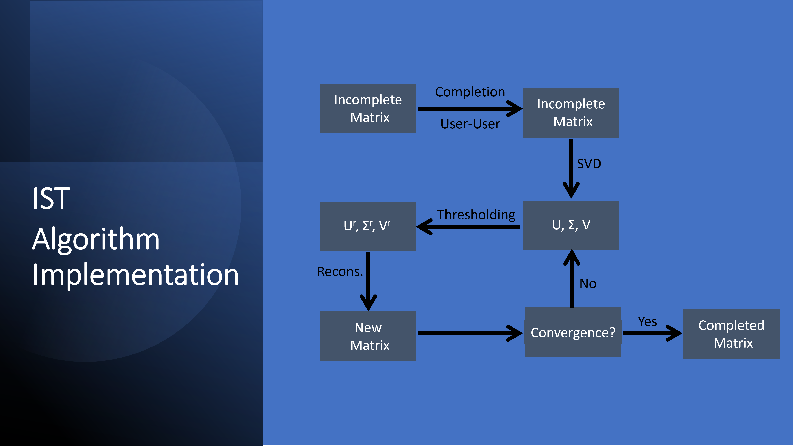

# Optimizing User Engagement: Developing Music Recommendation Systems

## Problem Definition

### The Context:
The rise of online music providers such as Spotify, Apple Music, Youtube Music, and Tidal has significantly impacted the music industry. These platforms offer users access to extensive music libraries, personalized playlists, and sharing features, revolutionizing how people discover and consume music. Central to these platforms are recommendation systems, employing algorithms to analyze user preferences and behaviors, thereby enhancing user experience and supporting artists.

### The Objective:
This project aims to:
- Analyze user interactions with songs.
- Perform statistical analysis on collected data.
- Apply collaborative filtering and content-based filtering algorithms.
- Predict user interactions with new songs.
- Recommend new songs likely to be enjoyed.
- Address the cold start problem for new users and songs.

### Problem Formulation:
The goal is to design and implement a machine learning-based recommendation system for the online music industry. The system should effectively recommend songs to users based on their past listening behavior and preferences.

## Data Dictionary

### song_data
- `song_id`: Unique identifier for each song.
- `title`: Title of the song.
- `Release`: Name of the released album.
- `Artist_name`: Name of the artist.
- `year`: Year of release.

### count_data
- `user_id`: Unique identifier for each user.
- `song_id`: Unique identifier for each song.
- `play_count`: Number of times the song was played.

## Data Source
[Million Song Dataset](http://millionsongdataset.com/)

## Building Various Models

### Popularity-Based Recommendation Systems:
This algorithm recommends the top N songs based on play counts, overcoming the cold start problem for new users.

### Collaborative Filtering Method:
Utilizes user-user/item-item similarity, matrix factorization, and cluster-based algorithms.

### Model Based Collaborative Filtering - Matrix Factorization:
Factorizes the user-item rating matrix to generate recommendations, effective for large datasets.

### Cluster Based Recommendation System:
Groups users/items into clusters based on similarities, improving recommendation quality.

### Iterative Singular Value Thresholding (IST):
Matrix factorization technique for sparse datasets, effectively filling missing values.

### Content Based Recommendation Systems:
Utilizes item attributes/features to make recommendations, effective for niche items.

## Model Evaluation

| Algorithm | RMSE   | Precision | Recall | F1 Score |
|-----------|--------|-----------|--------|----------|
| User-User | 1.0639 | 0.403     | 0.612  | 0.486    |
| Item-Item | 1.0154 | 0.320     | 0.512  | 0.394    |
| SVD       | 0.9767 | 0.425     | 0.584  | 0.492    |
| Cluster   | 1.0254 | 0.379     | 0.519  | 0.438    |
| IST       | 0.9079 | 0.541     | 0.683  | 0.604    |

Based on the evaluation metrics, the IST algorithm demonstrated the highest F1 score and lowest RMSE, making it the preferred method for recommendation. Further optimizations and refinements will be explored to enhance the system's performance and user satisfaction over time.

